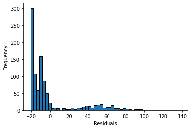

```python
from finetwork.data_collector import FinData
from finetwork.transformer import MarketCycle, Split, NetTransformer
from finetwork.distance_calculator import CalculateDistance
from finetwork.clusterer import NetClusterer
from finetwork.optimiser import Validator, Optimiser
from finetwork.plotter import Plotter

import pandas as pd
import numpy as np
import matplotlib.pyplot as plt
import networkx as nx
import json
import datetime
import statsmodels.api as sm
from bioinfokit.analys import stat
import seaborn as sns
import scipy.stats as stats
from statsmodels.formula.api import ols

import warnings
warnings.filterwarnings("ignore")
```

For the purpose of analysis one may want to identify the appropriate time intervals for selecting stocks to the investment portfolio and the following investment horizon. This can be done either by the means of expert estimations or using market-index based criterion values for identifying meaningful stages of market cycles. FiNetwork provides the functionality to evaluate these by plotting Wyckoff's stages of market cycle. This is done by calculating one of the criterion values (based on [Fei Ren et al., 2017]):
- "amplitude" criterion
- "trading day" criterion
- "and" criterion
- "or" criterion

Once the appropriate criterion and time window is determined, data can be splitted into corresponding time windows to 1) calculate distances based on correlations or dependecies among stocks in these time periods; and 2) to use these time windows as periods for estimation-investment horizons.

Let's first fix some date range for analysis as well as benchmark index, country of index, name of the market (needed to retrieve data using investpy library)


```python
FROM_DATE='01/01/2010'
TO_DATE='30/12/2020'
BENCHMARK_INDEX = 'S&P 500'
COUNTRY = 'United States'
MARKET = 'world_indices'
```


```python
for param in [(3,'or'),
              (4, 'or'),
              (5, 'or'), 
              (8, 'or')]:
    mc = MarketCycle(
            benchmark_index=BENCHMARK_INDEX,
            from_date=FROM_DATE, 
            to_date=TO_DATE,
            country=COUNTRY,
            market=MARKET,
            criterion=param[1],
            window=param[0],
            theta_min=0.45,
            theta_max=0.55,
        )
    mc.plot_cycles()
    mc.plot_index_with_cycles(name=f'Index {BENCHMARK_INDEX} for {FROM_DATE}-{TO_DATE},'
                                  f' criterion={param[1]}, window={param[0]}', save=False)
```


      0%|          | 0/1 [00:00<?, ?it/s]


      0%|          | 0/1 [00:00<?, ?it/s]


    

    


    

    


      0%|          | 0/1 [00:00<?, ?it/s]


      0%|          | 0/1 [00:00<?, ?it/s]


    

    


    

    


      0%|          | 0/1 [00:00<?, ?it/s]


      0%|          | 0/1 [00:00<?, ?it/s]


    

    


    

    


      0%|          | 0/1 [00:00<?, ?it/s]


      0%|          | 0/1 [00:00<?, ?it/s]


    

    


    

    


According to the above plots it seems that the optimal time partition would be made based on "or" criterion with window = 4 month as it represents the underlying markt movements more precisely. You can try other criterion values and/or periods.

Now we can download data for stocks included in the S&P 500 index (be careful! if data is unavailable or lacking for a particular stock (meaning that the appropriate network analysis can't be conducted with limited data), it will be excluded automatically). 


Names of tickers should be organised in a list.


```python
import random

sp500_companies = pd.read_csv(
    'https://raw.githubusercontent.com/datasets/'
    's-and-p-500-companies/master/data/constituents.csv'
)['Symbol']
sp500_companies = random.choices(sp500_companies, k=200)
```


```python
sp500 = FinData(
    from_date=FROM_DATE,
    to_date=TO_DATE,
    tickers=sp500_companies,
    country=COUNTRY, 
    market = "NYSE"
)
sp500_data = sp500.get_data(save=False)
```


      0%|          | 0/200 [00:00<?, ?it/s]


Let's separate data from the dictionary into two separate variables, namely with data on industries the companies relate to and the the stock data itself.


```python
sp500_industries = sp500_data['sectors']
sp500_data = sp500_data['data']
```

As you can see .get_data() method returns two dictionaries. The first one contains mapping between stocks and industries the company belongs to.

The second dictionary contains adjusted close prices and log returns for each datastamp


```python
selected_data = sp500_data[list(sp500_data.keys())[0]]
{list(sp500_data.keys())[5]: {k: v for k,v in selected_data.items() if k in list(selected_data.keys())[:5]}}
```


    {'SYY': {'2010-01-04 00:00:00': {'close_adj': 35.34330655959147,
       'log_return': nan},
      '2010-01-05 00:00:00': {'close_adj': 34.919987339038826,
       'log_return': -0.012049658335439695},
      '2010-01-06 00:00:00': {'close_adj': 34.881503773534064,
       'log_return': -0.0011026575160664187},
      '2010-01-07 00:00:00': {'close_adj': 34.29655357786141,
       'log_return': -0.01691184054077599},
      '2010-01-08 00:00:00': {'close_adj': 34.25037329925567,
       'log_return': -0.0013474064468343983}}}


Now we can split the stock data into time windows. 


```python
sp500_split = Split(
    sp500_data, 
    from_date=FROM_DATE, 
    to_date=TO_DATE, 
    window_size=4
).transform()
```

Once the data is splited into time windows the distances among stocks for each period can be calculated. The distances matrix can be then used to construct the stock market network for further analysis.


```python
sp500_dist = CalculateDistance(
    sp500_split,
    method='pearson',
    scaled=True
).transform()
```

Transformed data is the collection of dictionaries containing distance matrxes for each time window. 

Clustering analysis can be conducted on these graphs to identify communities in the stock market for each time period.


```python
clustering_method = 'Kmeans'
nc = NetClusterer(
    method=clustering_method, 
    data_dict=sp500_dist,
    return_validation_scores=True
) 
cluster_results = nc.fit()
```


```python
nc
```


    <finetwork.clusterer.clusterer.NetClusterer at 0x1b213d5f820>


NetClusterer object has a .print_scores() method returning the three score to estimate the clustering results quality.


```python
nc.print_scores()
```

    Kmeans clustering results
    +------------------------------+----------+
    | Metrics                      | Value    |
    +------------------------------+----------+
    | Mean calinski_harabasz_index | 117.3285 |
    | Mean sillhouette_score       | 0.5832   |
    | Mean davies_bouldin_score    | 0.6437   |
    +------------------------------+----------+
    

We can now visualise the results as a dinamic graph saving it to .gif format. partition can be performed either for industries (providing the dict of mapping between stocks and industries) or for clusters (providing the dict with clustering results)

For a better visualisation it's considered a good practice to first filter the network. In FiNetwork you can do it witj one of the following methods:
- Minimum Spanning Tree (mst), or
- Planar Maximally Filtered Graph (pmfg)


```python
nt = NetTransformer(method='mst')
filtered_data = nt.fit_transform(sp500_dist)
```


```python
filtered_data[list(filtered_data.keys())[0]]
```


    <networkx.classes.graph.Graph at 0x1b20e1a5070>


```python
gplt = Plotter(data=filtered_data, 
        plot_type='circus', 
        partition={k:sp500_industries for k in sp500_dist.keys()},
# specify path if you want to save all the gif frames
#        path='industries'
              )
gplt.plot()

gplt.mgif(gif_name='industries_partition',
    duration=1000)
```


```python
gplt = Plotter(data=filtered_data, 
        plot_type='circus', 
        partition=cluster_results,
#        path='clusters'
              )
gplt.plot()

gplt.mgif(gif_name='clusters_partition',
    duration=1000)
```


Once the optimal clustering method is identified and clustering is conducted optimiser can be used to select the optimal portfolio either randomly, based on industries partition or based on clustering results. It's required to specify the desired number of stocks to select in portfolio. One can repeat the procedure of selection for different sizes of portfolio to be able to assess the general quality of the method employed.


```python
portfolio_size = 15
selection = Optimiser(portfolio_size=portfolio_size).fit(cluster_results)
```

Optimiser has a .fit() method which returns dictionary containing lists of selected stocks from each cluster for each period of time.


```python
{list(selection.keys())[1]: selection[list(selection.keys())[1]]}
```


    {'2010-05-02-2010-09-01': {'Cluster 0': ['TER', 'ALL'],
      'Cluster 1': ['GM'],
      'Cluster 2': ['CTXS'],
      'Cluster 3': ['K'],
      'Cluster 4': ['WMT', 'NEM'],
      'Cluster 5': ['EOG', 'STX']}}


After selecting the portfolio the validation can be performed (aka back-testing).


```python
ret = Validator(sp500_split, selection)
ret.fit()
ret
```


    <finetwork.optimiser.validator.Validator at 0x1b2758cb1f0>


Algorithm identifies the optimal portfolio for each period of time and uses it to "invest" in a consequetive period. Return values for each period are then calculated.


```python
r = ret.returns()
r
```


    0    -0.063543
    1     0.196558
    2     0.146869
    3    -0.129605
    4     0.048294
    5     0.083229
    6     0.049145
    7    -0.029271
    8     0.070886
    9     0.060115
    10    0.105521
    11    0.068077
    12    0.040534
    13    0.026119
    14    0.033611
    15   -0.079863
    16    0.048916
    17    0.089861
    18    0.049411
    19    0.119430
    20    0.116351
    21    0.046212
    22    0.149112
    23    0.041318
    24    0.076110
    25   -0.136116
    26    0.222332
    27    0.031255
    28    0.067162
    29   -0.055841
    30    0.132588
    31    0.128890
    dtype: float64


Average portfolio performance metrics can be then calculated.


```python
perf_metrics = ret.performance_metrics()
```


```python
perf_metrics
```


    {'volatility': 0.08328841331935666,
     'calmar_ratio': 102.66620304723611,
     'sharpe_ratio': 10.507091924634702,
     'sortino_ratio': 20.622314912306415,
     'max_drawdown': -0.1361161667350742}


Now we can go through different portfolio sizes to estimate the avg performance of selected method.


```python
returns_dict = {}
performance_metrics_dict = {}
clustering_method = 'Kmeans'
dist_metrics = 'pearson'

nc = NetClusterer(
    clustering_method, 
    sp500_dist,
    return_validation_scores=True
) 
cluster_results = nc.fit()

if clustering_method!='None':
    nc.print_scores()

for portfolio_s in np.linspace(3,100,25).astype(int):
#     print(f'PORTFOLIO SIZE {portfolio_s}\n')    
    try:
        selection = Optimiser(portfolio_size=portfolio_s).fit(cluster_results)
        ret = Validator(sp500_split, selection)
        ret.fit()
        r = ret.returns()
        perf_metrics = ret.performance_metrics()
        if clustering_method=='None':
            returns_dict[f'metrics=nan, method={clustering_method}, portfolio_size={portfolio_s}'] = r
        else:
            returns_dict[f'metrics={dist_metrics}, method={clustering_method}, portfolio_size={portfolio_s}'] = r
                   
        performance_metrics_dict[
            f'metrics={dist_metrics}, method={clustering_method}, '
            f'portfolio_size={portfolio_s}'
        ] = perf_metrics  
                
                
    except:
        print(f'{clustering_method} with {portfolio_s} stocks pass')
        pass
    
```

    Kmeans clustering results
    +------------------------------+----------+
    | Metrics                      | Value    |
    +------------------------------+----------+
    | Mean calinski_harabasz_index | 117.3285 |
    | Mean sillhouette_score       | 0.5832   |
    | Mean davies_bouldin_score    | 0.6437   |
    +------------------------------+----------+
    

One can also shoose a more sophisticated approach and rather then relying on an "expert-assessed" selection of clustering method, methods of partition and distance metrics can select the most optimal set of methods for a particular market/market conditions using grid search on a parameters space


```python
returns_dict = {}
performance_metrics_dict = {}
for dist_metrics in [
    'pearson',
#     'theil_index',
    'atkinson_index'
]:
    print(dist_metrics)
    sp500_dist = CalculateDistance(
        sp500_split,
        method=dist_metrics,
        scaled=True,
    ).transform()
    for clustering_method in [
        'None',
        'Kmeans',
#         'Spectral', 
        'SpectralKmeans', 
#         'Kmedoids', 
        'SpectralGaussianMixture',
#         'GaussianMixture',
#         'Hierarchical'
    ]:
        try:
            print(f'Trying method: {clustering_method}\n')
            nc = NetClusterer(
                clustering_method, 
                sp500_dist,
                return_validation_scores=True
            ) 
            cluster_results = nc.fit()
            if clustering_method!='None':
                nc.print_scores()
                
            for portfolio_s in np.linspace(3,50,25).astype(int):
#                 print(f'PORTFOLIO SIZE {portfolio_s}\n')    
                try:

                    selection = Optimiser(portfolio_size=portfolio_s).fit(cluster_results)

                    ret = Validator(sp500_split, selection)
                    ret.fit()
                    r = ret.returns()
                    perf_metrics = ret.performance_metrics()
                    
                    if clustering_method=='None':
                        returns_dict[f'metrics=nan, method={clustering_method}, portfolio_size={portfolio_s}'] = r
                    else:
                        returns_dict[f'metrics={dist_metrics}, method={clustering_method}, portfolio_size={portfolio_s}'] = r

                    performance_metrics_dict[
                        f'metrics={dist_metrics}, method={clustering_method}, '
                        f'portfolio_size={portfolio_s}'
                    ] = perf_metrics  


                except:
                    print(f'{clustering_method} with {portfolio_s} stocks pass')
                    pass
    
    
        except:
            print(f'{clustering_method} pass')
            pass  
```

    pearson
    Trying method: None
    
    Trying method: Kmeans
    
    Kmeans clustering results
    +------------------------------+----------+
    | Metrics                      | Value    |
    +------------------------------+----------+
    | Mean calinski_harabasz_index | 117.3285 |
    | Mean sillhouette_score       | 0.5832   |
    | Mean davies_bouldin_score    | 0.6437   |
    +------------------------------+----------+
    Trying method: SpectralKmeans
    
    SpectralKmeans clustering results
    +------------------------------+---------+
    | Metrics                      | Value   |
    +------------------------------+---------+
    | Mean calinski_harabasz_index | 0.1957  |
    | Mean sillhouette_score       | -0.4582 |
    | Mean davies_bouldin_score    | 1.491   |
    +------------------------------+---------+
    Trying method: SpectralGaussianMixture
    
    SpectralGaussianMixture clustering results
    +------------------------------+---------+
    | Metrics                      | Value   |
    +------------------------------+---------+
    | Mean calinski_harabasz_index | 0.1957  |
    | Mean sillhouette_score       | -0.4582 |
    | Mean davies_bouldin_score    | 1.491   |
    +------------------------------+---------+
    atkinson_index
    Trying method: None
    
    Trying method: Kmeans
    
    Kmeans clustering results
    +------------------------------+--------+
    | Metrics                      | Value  |
    +------------------------------+--------+
    | Mean calinski_harabasz_index | 1.124  |
    | Mean sillhouette_score       | 0.004  |
    | Mean davies_bouldin_score    | 6.4846 |
    +------------------------------+--------+
    Trying method: SpectralKmeans
    
    SpectralKmeans clustering results
    +------------------------------+---------+
    | Metrics                      | Value   |
    +------------------------------+---------+
    | Mean calinski_harabasz_index | 0.9978  |
    | Mean sillhouette_score       | -0.0005 |
    | Mean davies_bouldin_score    | 0.9922  |
    +------------------------------+---------+
    Trying method: SpectralGaussianMixture
    
    SpectralGaussianMixture clustering results
    +------------------------------+---------+
    | Metrics                      | Value   |
    +------------------------------+---------+
    | Mean calinski_harabasz_index | 0.9978  |
    | Mean sillhouette_score       | -0.0005 |
    | Mean davies_bouldin_score    | 0.9922  |
    +------------------------------+---------+
    

You can now process the performance data to decide on the most efficient portfolio selection method.
(part of the following functionality will be later implemented in the package)


```python
results_df = pd.DataFrame(dict([(k, pd.Series(v)) for k,v in returns_dict.items()])).T
results_df.columns = [j[:10] for j in list(selection.keys())][1:]
```


```python
results_df = results_df.reset_index().rename(columns={'index':'params'})
```


```python
results_df.head()
```


<div>
<style scoped>
    .dataframe tbody tr th:only-of-type {
        vertical-align: middle;
    }

    .dataframe tbody tr th {
        vertical-align: top;
    }

    .dataframe thead th {
        text-align: right;
    }
</style>
<table border="1" class="dataframe">
  <thead>
    <tr style="text-align: right;">
      <th></th>
      <th>params</th>
      <th>2010-05-02</th>
      <th>2010-09-01</th>
      <th>2011-01-01</th>
      <th>2011-05-02</th>
      <th>2011-09-01</th>
      <th>2012-01-01</th>
      <th>2012-05-02</th>
      <th>2012-08-31</th>
      <th>2012-12-31</th>
      <th>...</th>
      <th>2018-09-01</th>
      <th>2019-01-01</th>
      <th>2019-05-02</th>
      <th>2019-09-01</th>
      <th>2020-01-01</th>
      <th>2020-05-02</th>
      <th>2020-08-31</th>
      <th>metrics</th>
      <th>method</th>
      <th>portfolio_size</th>
    </tr>
  </thead>
  <tbody>
    <tr>
      <th>0</th>
      <td>metrics=nan, method=None, portfolio_size=3</td>
      <td>-0.099120</td>
      <td>0.327825</td>
      <td>-0.000721</td>
      <td>0.032870</td>
      <td>-0.157499</td>
      <td>0.108660</td>
      <td>0.008911</td>
      <td>-0.034306</td>
      <td>0.132414</td>
      <td>...</td>
      <td>-0.077876</td>
      <td>0.215079</td>
      <td>0.068178</td>
      <td>0.159904</td>
      <td>-0.051738</td>
      <td>0.121952</td>
      <td>-0.046113</td>
      <td>metrics=nan</td>
      <td>method=None</td>
      <td>portfolio_size=3</td>
    </tr>
    <tr>
      <th>1</th>
      <td>metrics=nan, method=None, portfolio_size=4</td>
      <td>-0.044671</td>
      <td>0.150497</td>
      <td>0.084532</td>
      <td>-0.169965</td>
      <td>0.071598</td>
      <td>0.055709</td>
      <td>-0.003541</td>
      <td>0.020350</td>
      <td>0.026190</td>
      <td>...</td>
      <td>-0.213196</td>
      <td>0.132667</td>
      <td>-0.026347</td>
      <td>0.071347</td>
      <td>-0.063167</td>
      <td>0.263743</td>
      <td>0.075945</td>
      <td>metrics=nan</td>
      <td>method=None</td>
      <td>portfolio_size=4</td>
    </tr>
    <tr>
      <th>2</th>
      <td>metrics=nan, method=None, portfolio_size=6</td>
      <td>-0.132302</td>
      <td>0.128323</td>
      <td>0.100217</td>
      <td>-0.039264</td>
      <td>0.078473</td>
      <td>0.185625</td>
      <td>-0.029371</td>
      <td>0.003039</td>
      <td>0.149164</td>
      <td>...</td>
      <td>-0.028996</td>
      <td>0.170646</td>
      <td>0.119053</td>
      <td>0.101369</td>
      <td>-0.093452</td>
      <td>0.264307</td>
      <td>0.187409</td>
      <td>metrics=nan</td>
      <td>method=None</td>
      <td>portfolio_size=6</td>
    </tr>
    <tr>
      <th>3</th>
      <td>metrics=nan, method=None, portfolio_size=8</td>
      <td>-0.045903</td>
      <td>0.252046</td>
      <td>0.126770</td>
      <td>-0.138744</td>
      <td>0.130271</td>
      <td>0.068559</td>
      <td>0.040518</td>
      <td>0.081245</td>
      <td>0.132407</td>
      <td>...</td>
      <td>-0.076382</td>
      <td>0.178070</td>
      <td>0.059666</td>
      <td>0.122012</td>
      <td>-0.238685</td>
      <td>0.077602</td>
      <td>0.127669</td>
      <td>metrics=nan</td>
      <td>method=None</td>
      <td>portfolio_size=8</td>
    </tr>
    <tr>
      <th>4</th>
      <td>metrics=nan, method=None, portfolio_size=10</td>
      <td>-0.120426</td>
      <td>0.207643</td>
      <td>0.166167</td>
      <td>-0.106156</td>
      <td>-0.017413</td>
      <td>0.169304</td>
      <td>0.065857</td>
      <td>0.056553</td>
      <td>0.167322</td>
      <td>...</td>
      <td>-0.117022</td>
      <td>0.135344</td>
      <td>0.076504</td>
      <td>0.145958</td>
      <td>-0.341684</td>
      <td>0.219122</td>
      <td>0.137498</td>
      <td>metrics=nan</td>
      <td>method=None</td>
      <td>portfolio_size=10</td>
    </tr>
  </tbody>
</table>
<p>5 rows × 36 columns</p>
</div>


```python
performance_df =  pd.DataFrame(dict([(k, pd.Series(v)) for k,v in performance_metrics_dict.items()])).T
performance_df.head()
```


<div>
<style scoped>
    .dataframe tbody tr th:only-of-type {
        vertical-align: middle;
    }

    .dataframe tbody tr th {
        vertical-align: top;
    }

    .dataframe thead th {
        text-align: right;
    }
</style>
<table border="1" class="dataframe">
  <thead>
    <tr style="text-align: right;">
      <th></th>
      <th>volatility</th>
      <th>calmar_ratio</th>
      <th>sharpe_ratio</th>
      <th>sortino_ratio</th>
      <th>max_drawdown</th>
    </tr>
  </thead>
  <tbody>
    <tr>
      <th>metrics=pearson, method=None, portfolio_size=3</th>
      <td>0.121560</td>
      <td>31.528331</td>
      <td>4.575249</td>
      <td>5.239820</td>
      <td>-0.281691</td>
    </tr>
    <tr>
      <th>metrics=pearson, method=None, portfolio_size=4</th>
      <td>0.116588</td>
      <td>27.625938</td>
      <td>4.344200</td>
      <td>6.451668</td>
      <td>-0.292763</td>
    </tr>
    <tr>
      <th>metrics=pearson, method=None, portfolio_size=6</th>
      <td>0.089234</td>
      <td>50.700277</td>
      <td>8.082482</td>
      <td>13.865980</td>
      <td>-0.227161</td>
    </tr>
    <tr>
      <th>metrics=pearson, method=None, portfolio_size=8</th>
      <td>0.099253</td>
      <td>45.918904</td>
      <td>7.275367</td>
      <td>8.901148</td>
      <td>-0.251119</td>
    </tr>
    <tr>
      <th>metrics=pearson, method=None, portfolio_size=10</th>
      <td>0.101001</td>
      <td>53.478369</td>
      <td>6.890327</td>
      <td>11.123149</td>
      <td>-0.207805</td>
    </tr>
  </tbody>
</table>
</div>


For visualisation you can plot returns from the back-test together with market cycle stages to decide which method performs best during different market conditions.


```python
cols_dict = {'markup': 'green', 
             'markdown': 'red', 
             'accumulation': 'blue', 
             'distribution': 'orange'}

market_cycles = MarketCycle(
    benchmark_index='S&P 500', 
    from_date=FROM_DATE,  
    to_date=TO_DATE,  
    country='United States', 
    market='world_indices', 
    criterion='or', 
    window=4
).fit(return_criterion_vals=False)[0].values()
col = [cols_dict[cycle] for cycle in market_cycles]
dates = [j[:10] for j in list(selection.keys())][1:]
```


      0%|          | 0/1 [00:00<?, ?it/s]


```python
results_df[['metrics', 'method', 'portfolio_size']] = results_df.params.str.split(", ",expand=True)
```

Let's calculate the average returns for different portfolio sizes groupped by employed metric and method for portfolio selection.


```python
results_mean = results_df.groupby(['metrics', 'method']).agg('mean')
results_mean.head()
```


<div>
<style scoped>
    .dataframe tbody tr th:only-of-type {
        vertical-align: middle;
    }

    .dataframe tbody tr th {
        vertical-align: top;
    }

    .dataframe thead th {
        text-align: right;
    }
</style>
<table border="1" class="dataframe">
  <thead>
    <tr style="text-align: right;">
      <th></th>
      <th></th>
      <th>2010-05-02</th>
      <th>2010-09-01</th>
      <th>2011-01-01</th>
      <th>2011-05-02</th>
      <th>2011-09-01</th>
      <th>2012-01-01</th>
      <th>2012-05-02</th>
      <th>2012-08-31</th>
      <th>2012-12-31</th>
      <th>2013-05-02</th>
      <th>...</th>
      <th>2017-09-01</th>
      <th>2017-12-31</th>
      <th>2018-05-02</th>
      <th>2018-09-01</th>
      <th>2019-01-01</th>
      <th>2019-05-02</th>
      <th>2019-09-01</th>
      <th>2020-01-01</th>
      <th>2020-05-02</th>
      <th>2020-08-31</th>
    </tr>
    <tr>
      <th>metrics</th>
      <th>method</th>
      <th></th>
      <th></th>
      <th></th>
      <th></th>
      <th></th>
      <th></th>
      <th></th>
      <th></th>
      <th></th>
      <th></th>
      <th></th>
      <th></th>
      <th></th>
      <th></th>
      <th></th>
      <th></th>
      <th></th>
      <th></th>
      <th></th>
      <th></th>
      <th></th>
    </tr>
  </thead>
  <tbody>
    <tr>
      <th rowspan="3" valign="top">metrics=atkinson_index</th>
      <th>method=Kmeans</th>
      <td>-0.124579</td>
      <td>0.209561</td>
      <td>0.097239</td>
      <td>-0.072329</td>
      <td>0.008874</td>
      <td>0.122797</td>
      <td>-0.006597</td>
      <td>0.016008</td>
      <td>0.124961</td>
      <td>-0.000999</td>
      <td>...</td>
      <td>0.088862</td>
      <td>0.016372</td>
      <td>0.118114</td>
      <td>-0.122030</td>
      <td>0.189187</td>
      <td>0.057780</td>
      <td>0.068857</td>
      <td>-0.170475</td>
      <td>0.219053</td>
      <td>0.090912</td>
    </tr>
    <tr>
      <th>method=SpectralGaussianMixture</th>
      <td>-0.109585</td>
      <td>0.173414</td>
      <td>0.104990</td>
      <td>-0.099440</td>
      <td>0.046519</td>
      <td>0.173206</td>
      <td>0.054886</td>
      <td>0.057543</td>
      <td>0.164701</td>
      <td>0.019262</td>
      <td>...</td>
      <td>0.086247</td>
      <td>0.006313</td>
      <td>0.083063</td>
      <td>-0.143577</td>
      <td>0.192282</td>
      <td>0.075486</td>
      <td>0.085316</td>
      <td>-0.183875</td>
      <td>0.207415</td>
      <td>0.155402</td>
    </tr>
    <tr>
      <th>method=SpectralKmeans</th>
      <td>-0.098245</td>
      <td>0.186244</td>
      <td>0.124448</td>
      <td>-0.095847</td>
      <td>0.066123</td>
      <td>0.149147</td>
      <td>0.060563</td>
      <td>0.057839</td>
      <td>0.150821</td>
      <td>0.020448</td>
      <td>...</td>
      <td>0.097517</td>
      <td>-0.009264</td>
      <td>0.096942</td>
      <td>-0.140274</td>
      <td>0.184426</td>
      <td>0.048940</td>
      <td>0.095662</td>
      <td>-0.171284</td>
      <td>0.219534</td>
      <td>0.124166</td>
    </tr>
    <tr>
      <th>metrics=nan</th>
      <th>method=None</th>
      <td>-0.107758</td>
      <td>0.205707</td>
      <td>0.100811</td>
      <td>-0.098564</td>
      <td>0.036212</td>
      <td>0.124194</td>
      <td>-0.001063</td>
      <td>0.031527</td>
      <td>0.116420</td>
      <td>0.008182</td>
      <td>...</td>
      <td>0.099368</td>
      <td>-0.007869</td>
      <td>0.082479</td>
      <td>-0.126548</td>
      <td>0.178582</td>
      <td>0.037393</td>
      <td>0.095210</td>
      <td>-0.177608</td>
      <td>0.191927</td>
      <td>0.100947</td>
    </tr>
    <tr>
      <th>metrics=pearson</th>
      <th>method=Kmeans</th>
      <td>-0.116166</td>
      <td>0.240591</td>
      <td>0.079560</td>
      <td>-0.102148</td>
      <td>0.052999</td>
      <td>0.123747</td>
      <td>0.005032</td>
      <td>0.002557</td>
      <td>0.125640</td>
      <td>0.022786</td>
      <td>...</td>
      <td>0.115949</td>
      <td>-0.004993</td>
      <td>0.067234</td>
      <td>-0.139984</td>
      <td>0.161995</td>
      <td>0.049577</td>
      <td>0.106764</td>
      <td>-0.141301</td>
      <td>0.160699</td>
      <td>0.075944</td>
    </tr>
  </tbody>
</table>
<p>5 rows × 32 columns</p>
</div>


```python
def get_cmap(n, name='hsv'):
    return plt.cm.get_cmap(name, n)

cmap = get_cmap(len(results_mean.index), 'jet')
```


```python
plt.figure(figsize=(15,8))
for i, k in enumerate(results_mean.index):
    plt.plot(
        dates, 
        results_mean.loc[k], 
        label=k, 
        color=cmap(i)
    )
        
for i in range(len(dates)-1):
    plt.axvspan(dates[i], dates[i+1], facecolor=col[i], alpha=0.12)
plt.xticks(rotation=75)
plt.legend(bbox_to_anchor=(1.05, 1), loc='upper left')
plt.title(f'Portfolio returns for {dates[0]}-{dates[-1]}')
plt.show()  
```


    

    


```python
df = performance_df
df['Params'] = df.index
df[['metrics', 'method', 'portfolio_size']] = df.Params.str.split(', ',expand=True)
df = df.fillna(0)
```


```python
df_melt = pd.melt(df.reset_index(),
                  id_vars=['metrics', 'method', 'portfolio_size'], 
                  value_vars=['volatility',
                              'calmar_ratio',
                               'sharpe_ratio',
                               'sortino_ratio',
                               'max_drawdown'])

df_melt.columns = ['metrics', 'method', 'portfolio_size', 'performance_metrics', 'value']
```


```python
df_melt.head()
```


<div>
<style scoped>
    .dataframe tbody tr th:only-of-type {
        vertical-align: middle;
    }

    .dataframe tbody tr th {
        vertical-align: top;
    }

    .dataframe thead th {
        text-align: right;
    }
</style>
<table border="1" class="dataframe">
  <thead>
    <tr style="text-align: right;">
      <th></th>
      <th>metrics</th>
      <th>method</th>
      <th>portfolio_size</th>
      <th>performance_metrics</th>
      <th>value</th>
    </tr>
  </thead>
  <tbody>
    <tr>
      <th>0</th>
      <td>metrics=pearson</td>
      <td>method=None</td>
      <td>portfolio_size=3</td>
      <td>volatility</td>
      <td>0.121560</td>
    </tr>
    <tr>
      <th>1</th>
      <td>metrics=pearson</td>
      <td>method=None</td>
      <td>portfolio_size=4</td>
      <td>volatility</td>
      <td>0.116588</td>
    </tr>
    <tr>
      <th>2</th>
      <td>metrics=pearson</td>
      <td>method=None</td>
      <td>portfolio_size=6</td>
      <td>volatility</td>
      <td>0.089234</td>
    </tr>
    <tr>
      <th>3</th>
      <td>metrics=pearson</td>
      <td>method=None</td>
      <td>portfolio_size=8</td>
      <td>volatility</td>
      <td>0.099253</td>
    </tr>
    <tr>
      <th>4</th>
      <td>metrics=pearson</td>
      <td>method=None</td>
      <td>portfolio_size=10</td>
      <td>volatility</td>
      <td>0.101001</td>
    </tr>
  </tbody>
</table>
</div>


Let's have a look at the distribution of performance metrics values.


```python
selection = ['volatility',
             'calmar_ratio',
             'sharpe_ratio',
             'sortino_ratio',
             'max_drawdown']
fig, axes = plt.subplots(1, len(selection), figsize=(10,6))
for i, col in enumerate(selection):
    ax = sns.boxplot(y=df[col], ax=axes.flatten()[i], color='#99c2a2')
    ax = sns.swarmplot(y=df[col], ax=axes.flatten()[i], color='#7d0013', size=1)
    ax.set_ylim(df[col].min(), df[col].max())
    ax.set_ylabel(col)
plt.tight_layout()
plt.show()
```


    

    


We can also conduct different variations of ANOVA to estimate the importance of different methods of portfolio selection


```python
fvalue, pvalue = stats.f_oneway(
    df['volatility'], 
    df['calmar_ratio'], 
    df['sharpe_ratio'], 
    df['sortino_ratio'], 
    df['max_drawdown']
    )
print(f'F-value: {fvalue},\np-value: {pvalue}')
```

    F-value: 1733.273514838168,
    p-value: 0.0
    


```python
# get ANOVA table as R like output
import matplotlib.pyplot as plt
import seaborn as sns
import scipy.stats as stats
import statsmodels.api as sm
from statsmodels.formula.api import ols
dep = ['metrics', 'method', 'portfolio_size']

```


```python
# Ordinary Least Squares (OLS) model
model = ols(f'value ~ C(metrics)', data=df_melt).fit()
anova_table = sm.stats.anova_lm(model, typ=2)
anova_table
```


<div>
<style scoped>
    .dataframe tbody tr th:only-of-type {
        vertical-align: middle;
    }

    .dataframe tbody tr th {
        vertical-align: top;
    }

    .dataframe thead th {
        text-align: right;
    }
</style>
<table border="1" class="dataframe">
  <thead>
    <tr style="text-align: right;">
      <th></th>
      <th>sum_sq</th>
      <th>df</th>
      <th>F</th>
      <th>PR(&gt;F)</th>
    </tr>
  </thead>
  <tbody>
    <tr>
      <th>C(metrics)</th>
      <td>32.642729</td>
      <td>1.0</td>
      <td>0.039413</td>
      <td>0.842673</td>
    </tr>
    <tr>
      <th>Residual</th>
      <td>826563.406729</td>
      <td>998.0</td>
      <td>NaN</td>
      <td>NaN</td>
    </tr>
  </tbody>
</table>
</div>


```python
model = ols(f'value ~ C(method)', data=df_melt).fit()
anova_table = sm.stats.anova_lm(model, typ=2)
anova_table
```


<div>
<style scoped>
    .dataframe tbody tr th:only-of-type {
        vertical-align: middle;
    }

    .dataframe tbody tr th {
        vertical-align: top;
    }

    .dataframe thead th {
        text-align: right;
    }
</style>
<table border="1" class="dataframe">
  <thead>
    <tr style="text-align: right;">
      <th></th>
      <th>sum_sq</th>
      <th>df</th>
      <th>F</th>
      <th>PR(&gt;F)</th>
    </tr>
  </thead>
  <tbody>
    <tr>
      <th>C(method)</th>
      <td>1300.393885</td>
      <td>3.0</td>
      <td>0.523123</td>
      <td>0.666458</td>
    </tr>
    <tr>
      <th>Residual</th>
      <td>825295.655573</td>
      <td>996.0</td>
      <td>NaN</td>
      <td>NaN</td>
    </tr>
  </tbody>
</table>
</div>


```python
model = ols(f'value ~ C(portfolio_size)', data=df_melt).fit()
anova_table = sm.stats.anova_lm(model, typ=2)
anova_table
```


<div>
<style scoped>
    .dataframe tbody tr th:only-of-type {
        vertical-align: middle;
    }

    .dataframe tbody tr th {
        vertical-align: top;
    }

    .dataframe thead th {
        text-align: right;
    }
</style>
<table border="1" class="dataframe">
  <thead>
    <tr style="text-align: right;">
      <th></th>
      <th>sum_sq</th>
      <th>df</th>
      <th>F</th>
      <th>PR(&gt;F)</th>
    </tr>
  </thead>
  <tbody>
    <tr>
      <th>C(portfolio_size)</th>
      <td>5101.075648</td>
      <td>24.0</td>
      <td>0.252261</td>
      <td>0.999916</td>
    </tr>
    <tr>
      <th>Residual</th>
      <td>821494.973810</td>
      <td>975.0</td>
      <td>NaN</td>
      <td>NaN</td>
    </tr>
  </tbody>
</table>
</div>


```python
# ANOVA table using bioinfokit v1.0.3 or later (it uses wrapper script for anova_lm)
res = stat()
res.anova_stat(df=df_melt, res_var='value', anova_model=f'value ~ C(metrics)')
res_an = res.anova_summary
res_an
```


<div>
<style scoped>
    .dataframe tbody tr th:only-of-type {
        vertical-align: middle;
    }

    .dataframe tbody tr th {
        vertical-align: top;
    }

    .dataframe thead th {
        text-align: right;
    }
</style>
<table border="1" class="dataframe">
  <thead>
    <tr style="text-align: right;">
      <th></th>
      <th>df</th>
      <th>sum_sq</th>
      <th>mean_sq</th>
      <th>F</th>
      <th>PR(&gt;F)</th>
    </tr>
  </thead>
  <tbody>
    <tr>
      <th>C(metrics)</th>
      <td>1.0</td>
      <td>32.642729</td>
      <td>32.642729</td>
      <td>0.039413</td>
      <td>0.842673</td>
    </tr>
    <tr>
      <th>Residual</th>
      <td>998.0</td>
      <td>826563.406729</td>
      <td>828.219846</td>
      <td>NaN</td>
      <td>NaN</td>
    </tr>
  </tbody>
</table>
</div>


```python
plt.hist(res.anova_model_out.resid, bins='auto', histtype='bar', ec='k') 
plt.xlabel("Residuals")
plt.ylabel('Frequency')
plt.show()
```


    

    


```python
sm.qqplot(res.anova_std_residuals, line='45')
plt.xlabel("Theoretical Quantiles")
plt.ylabel("Standardized Residuals")
plt.show()
```


    

    


```python
res = stat()
res.anova_stat(df=df_melt, res_var='value', anova_model=f'value ~ C(method)')
res_an = res.anova_summary
res_an
```


<div>
<style scoped>
    .dataframe tbody tr th:only-of-type {
        vertical-align: middle;
    }

    .dataframe tbody tr th {
        vertical-align: top;
    }

    .dataframe thead th {
        text-align: right;
    }
</style>
<table border="1" class="dataframe">
  <thead>
    <tr style="text-align: right;">
      <th></th>
      <th>df</th>
      <th>sum_sq</th>
      <th>mean_sq</th>
      <th>F</th>
      <th>PR(&gt;F)</th>
    </tr>
  </thead>
  <tbody>
    <tr>
      <th>C(method)</th>
      <td>3.0</td>
      <td>1300.393885</td>
      <td>433.464628</td>
      <td>0.523123</td>
      <td>0.666458</td>
    </tr>
    <tr>
      <th>Residual</th>
      <td>996.0</td>
      <td>825295.655573</td>
      <td>828.610096</td>
      <td>NaN</td>
      <td>NaN</td>
    </tr>
  </tbody>
</table>
</div>


```python
plt.hist(res.anova_model_out.resid, bins='auto', histtype='bar', ec='k') 
plt.xlabel("Residuals")
plt.ylabel('Frequency')
plt.show()
```


    

    


```python
res = stat()
res.anova_stat(df=df_melt, res_var='value', anova_model=f'value ~ C(portfolio_size)')
res_an = res.anova_summary
res_an
```


<div>
<style scoped>
    .dataframe tbody tr th:only-of-type {
        vertical-align: middle;
    }

    .dataframe tbody tr th {
        vertical-align: top;
    }

    .dataframe thead th {
        text-align: right;
    }
</style>
<table border="1" class="dataframe">
  <thead>
    <tr style="text-align: right;">
      <th></th>
      <th>df</th>
      <th>sum_sq</th>
      <th>mean_sq</th>
      <th>F</th>
      <th>PR(&gt;F)</th>
    </tr>
  </thead>
  <tbody>
    <tr>
      <th>C(portfolio_size)</th>
      <td>24.0</td>
      <td>5101.075648</td>
      <td>212.544819</td>
      <td>0.252261</td>
      <td>0.999916</td>
    </tr>
    <tr>
      <th>Residual</th>
      <td>975.0</td>
      <td>821494.973810</td>
      <td>842.558947</td>
      <td>NaN</td>
      <td>NaN</td>
    </tr>
  </tbody>
</table>
</div>


```python
# perform multiple pairwise comparison (Tukey's HSD)
res = stat()
res.tukey_hsd(df=df_melt, res_var='value', xfac_var='metrics', 
              anova_model=f'value ~ C(metrics)')
res_tuk_var = res.tukey_summary
res_tuk_var
```


<div>
<style scoped>
    .dataframe tbody tr th:only-of-type {
        vertical-align: middle;
    }

    .dataframe tbody tr th {
        vertical-align: top;
    }

    .dataframe thead th {
        text-align: right;
    }
</style>
<table border="1" class="dataframe">
  <thead>
    <tr style="text-align: right;">
      <th></th>
      <th>group1</th>
      <th>group2</th>
      <th>Diff</th>
      <th>Lower</th>
      <th>Upper</th>
      <th>q-value</th>
      <th>p-value</th>
    </tr>
  </thead>
  <tbody>
    <tr>
      <th>0</th>
      <td>metrics=pearson</td>
      <td>metrics=atkinson_index</td>
      <td>0.361346</td>
      <td>-3.210378</td>
      <td>3.93307</td>
      <td>0.28076</td>
      <td>0.846938</td>
    </tr>
  </tbody>
</table>
</div>


```python
res = stat()
res.tukey_hsd(df=df_melt, res_var='value', xfac_var='method', 
              anova_model=f'value ~ C(method)')
res_tuk_var = res.tukey_summary
res_tuk_var
```


<div>
<style scoped>
    .dataframe tbody tr th:only-of-type {
        vertical-align: middle;
    }

    .dataframe tbody tr th {
        vertical-align: top;
    }

    .dataframe thead th {
        text-align: right;
    }
</style>
<table border="1" class="dataframe">
  <thead>
    <tr style="text-align: right;">
      <th></th>
      <th>group1</th>
      <th>group2</th>
      <th>Diff</th>
      <th>Lower</th>
      <th>Upper</th>
      <th>q-value</th>
      <th>p-value</th>
    </tr>
  </thead>
  <tbody>
    <tr>
      <th>0</th>
      <td>method=None</td>
      <td>method=Kmeans</td>
      <td>1.608360</td>
      <td>-5.017265</td>
      <td>8.233985</td>
      <td>0.883442</td>
      <td>0.900000</td>
    </tr>
    <tr>
      <th>1</th>
      <td>method=None</td>
      <td>method=SpectralKmeans</td>
      <td>1.594175</td>
      <td>-5.031450</td>
      <td>8.219800</td>
      <td>0.875651</td>
      <td>0.900000</td>
    </tr>
    <tr>
      <th>2</th>
      <td>method=None</td>
      <td>method=SpectralGaussianMixture</td>
      <td>3.225320</td>
      <td>-3.400305</td>
      <td>9.850945</td>
      <td>1.771608</td>
      <td>0.582205</td>
    </tr>
    <tr>
      <th>3</th>
      <td>method=Kmeans</td>
      <td>method=SpectralKmeans</td>
      <td>0.014185</td>
      <td>-6.611440</td>
      <td>6.639811</td>
      <td>0.007792</td>
      <td>0.900000</td>
    </tr>
    <tr>
      <th>4</th>
      <td>method=Kmeans</td>
      <td>method=SpectralGaussianMixture</td>
      <td>1.616960</td>
      <td>-5.008665</td>
      <td>8.242585</td>
      <td>0.888166</td>
      <td>0.900000</td>
    </tr>
    <tr>
      <th>5</th>
      <td>method=SpectralKmeans</td>
      <td>method=SpectralGaussianMixture</td>
      <td>1.631145</td>
      <td>-4.994480</td>
      <td>8.256770</td>
      <td>0.895958</td>
      <td>0.900000</td>
    </tr>
  </tbody>
</table>
</div>


```python
res = stat()
res.tukey_hsd(df=df_melt, res_var='value', xfac_var='portfolio_size', 
              anova_model=f'value ~ C(portfolio_size)')
res_tuk_var = res.tukey_summary
res_tuk_var
```


<div>
<style scoped>
    .dataframe tbody tr th:only-of-type {
        vertical-align: middle;
    }

    .dataframe tbody tr th {
        vertical-align: top;
    }

    .dataframe thead th {
        text-align: right;
    }
</style>
<table border="1" class="dataframe">
  <thead>
    <tr style="text-align: right;">
      <th></th>
      <th>group1</th>
      <th>group2</th>
      <th>Diff</th>
      <th>Lower</th>
      <th>Upper</th>
      <th>q-value</th>
      <th>p-value</th>
    </tr>
  </thead>
  <tbody>
    <tr>
      <th>0</th>
      <td>portfolio_size=3</td>
      <td>portfolio_size=4</td>
      <td>6.031928</td>
      <td>-17.780582</td>
      <td>29.844438</td>
      <td>1.314274</td>
      <td>0.9</td>
    </tr>
    <tr>
      <th>1</th>
      <td>portfolio_size=3</td>
      <td>portfolio_size=6</td>
      <td>11.431290</td>
      <td>-12.381220</td>
      <td>35.243800</td>
      <td>2.490721</td>
      <td>0.9</td>
    </tr>
    <tr>
      <th>2</th>
      <td>portfolio_size=3</td>
      <td>portfolio_size=8</td>
      <td>10.618755</td>
      <td>-13.193755</td>
      <td>34.431265</td>
      <td>2.313681</td>
      <td>0.9</td>
    </tr>
    <tr>
      <th>3</th>
      <td>portfolio_size=3</td>
      <td>portfolio_size=10</td>
      <td>7.064787</td>
      <td>-16.747723</td>
      <td>30.877297</td>
      <td>1.539320</td>
      <td>0.9</td>
    </tr>
    <tr>
      <th>4</th>
      <td>portfolio_size=3</td>
      <td>portfolio_size=12</td>
      <td>6.114621</td>
      <td>-17.697889</td>
      <td>29.927131</td>
      <td>1.332292</td>
      <td>0.9</td>
    </tr>
    <tr>
      <th>...</th>
      <td>...</td>
      <td>...</td>
      <td>...</td>
      <td>...</td>
      <td>...</td>
      <td>...</td>
      <td>...</td>
    </tr>
    <tr>
      <th>295</th>
      <td>portfolio_size=44</td>
      <td>portfolio_size=48</td>
      <td>1.792324</td>
      <td>-22.020186</td>
      <td>25.604834</td>
      <td>0.390523</td>
      <td>0.9</td>
    </tr>
    <tr>
      <th>296</th>
      <td>portfolio_size=44</td>
      <td>portfolio_size=50</td>
      <td>2.387055</td>
      <td>-21.425455</td>
      <td>26.199565</td>
      <td>0.520106</td>
      <td>0.9</td>
    </tr>
    <tr>
      <th>297</th>
      <td>portfolio_size=46</td>
      <td>portfolio_size=48</td>
      <td>2.713713</td>
      <td>-21.098797</td>
      <td>26.526223</td>
      <td>0.591281</td>
      <td>0.9</td>
    </tr>
    <tr>
      <th>298</th>
      <td>portfolio_size=46</td>
      <td>portfolio_size=50</td>
      <td>3.308444</td>
      <td>-20.504066</td>
      <td>27.120954</td>
      <td>0.720865</td>
      <td>0.9</td>
    </tr>
    <tr>
      <th>299</th>
      <td>portfolio_size=48</td>
      <td>portfolio_size=50</td>
      <td>0.594731</td>
      <td>-23.217779</td>
      <td>24.407241</td>
      <td>0.129584</td>
      <td>0.9</td>
    </tr>
  </tbody>
</table>
<p>300 rows × 7 columns</p>
</div>


```python
res = stat()
res.levene(df=df_melt, res_var='value', xfac_var='metrics', center='trimmed')
metr_lev = res.levene_summary
metr_lev
```


<div>
<style scoped>
    .dataframe tbody tr th:only-of-type {
        vertical-align: middle;
    }

    .dataframe tbody tr th {
        vertical-align: top;
    }

    .dataframe thead th {
        text-align: right;
    }
</style>
<table border="1" class="dataframe">
  <thead>
    <tr style="text-align: right;">
      <th></th>
      <th>Parameter</th>
      <th>Value</th>
    </tr>
  </thead>
  <tbody>
    <tr>
      <th>0</th>
      <td>Test statistics (W)</td>
      <td>0.1595</td>
    </tr>
    <tr>
      <th>1</th>
      <td>Degrees of freedom (Df)</td>
      <td>1.0000</td>
    </tr>
    <tr>
      <th>2</th>
      <td>p value</td>
      <td>0.6897</td>
    </tr>
  </tbody>
</table>
</div>


```python
res = stat()
res.levene(df=df_melt, res_var='value', xfac_var='method', center='trimmed')
method_lev = res.levene_summary
method_lev
```


<div>
<style scoped>
    .dataframe tbody tr th:only-of-type {
        vertical-align: middle;
    }

    .dataframe tbody tr th {
        vertical-align: top;
    }

    .dataframe thead th {
        text-align: right;
    }
</style>
<table border="1" class="dataframe">
  <thead>
    <tr style="text-align: right;">
      <th></th>
      <th>Parameter</th>
      <th>Value</th>
    </tr>
  </thead>
  <tbody>
    <tr>
      <th>0</th>
      <td>Test statistics (W)</td>
      <td>1.6447</td>
    </tr>
    <tr>
      <th>1</th>
      <td>Degrees of freedom (Df)</td>
      <td>3.0000</td>
    </tr>
    <tr>
      <th>2</th>
      <td>p value</td>
      <td>0.1775</td>
    </tr>
  </tbody>
</table>
</div>


```python
res = stat()
res.levene(df=df_melt, res_var='value', xfac_var='portfolio_size', center='trimmed')
size_lev = res.levene_summary
size_lev
```


<div>
<style scoped>
    .dataframe tbody tr th:only-of-type {
        vertical-align: middle;
    }

    .dataframe tbody tr th {
        vertical-align: top;
    }

    .dataframe thead th {
        text-align: right;
    }
</style>
<table border="1" class="dataframe">
  <thead>
    <tr style="text-align: right;">
      <th></th>
      <th>Parameter</th>
      <th>Value</th>
    </tr>
  </thead>
  <tbody>
    <tr>
      <th>0</th>
      <td>Test statistics (W)</td>
      <td>0.7927</td>
    </tr>
    <tr>
      <th>1</th>
      <td>Degrees of freedom (Df)</td>
      <td>24.0000</td>
    </tr>
    <tr>
      <th>2</th>
      <td>p value</td>
      <td>0.7490</td>
    </tr>
  </tbody>
</table>
</div>


```python

```
